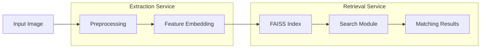

# IronClad Visual Search System Report

## System Design

The face recognition system consists of two primary services working together in a pipeline architecture:

### Extraction Service
The extraction service handles image preprocessing and feature embedding generation using FaceNet's InceptionResnetV1 architecture, with embeddings derived from the VGGFace2 model. It processes raw images through standardization steps, including resizing to 160x160 pixels, and converts them into high-dimensional feature vectors optimized for face recognition tasks.

### Retrieval Service  
The retrieval service manages the storage and searching of face embeddings using FAISS. It implements multiple indexing strategies (Flat, IVF, PQ, HNSW) and supports various distance metrics (Euclidean, cosine, Manhattan) for efficient similarity search across the face embedding database.

## Metrics Definition

### Offline Metrics

To assess the performance of the face recognition system during development and testing, the following offline metrics are used to evaluate retrieval accuracy and ranking quality:

- **Mean Reciprocal Rank (MRR)**: MRR calculates the average of reciprocal ranks for the first relevant result across all queries, which emphasizes retrieving correct matches as early as possible. This metric is particularly useful in facial recognition, where accurate identification in the top few results is critical. Higher MRR values, closer to 1.0, signify that correct results are ranked higher on average.

- **Precision@k**: This metric calculates the fraction of relevant matches within the top-k results for each query. Precision@k reflects the system's ability to include correct identifications among the top-k, giving insight into how accurate results are within a limited selection.

- **Recall@k**: This metric indicates the fraction of total relevant matches retrieved within the top-k results. Recall@k is particularly important in face recognition applications where it’s essential to capture all relevant identities within a reasonable cutoff.

- **Mean Average Precision@k (MAP@k)**: MAP@k combines precision with rank consideration by averaging the precision scores at ranks where relevant results appear, providing a comprehensive measure of the retrieval and ranking performance across queries. Higher MAP@k values suggest better ranking and relevance accuracy.

These offline metrics, computed using a representative test set, give a thorough view of the system’s accuracy and ranking quality, enabling optimization based on retrieval accuracy and alignment with expected ranking behavior.

### Online Metrics

For production monitoring, we track real-time performance metrics:

- **Throughput**: Measures the number of iterations processed per second, indicating the system's efficiency and performance in handling queries. This metric is critical for assessing how well the system can manage high volumes of requests, providing insights into potential bottlenecks and scalability. Monitoring throughput ensures that the system can meet user demands, particularly during peak times, and contributes to an overall smooth and responsive user experience.

- **Error Rate**: Measures the percentage of failed queries, categorized by error type (e.g., embedding failure, retrieval timeout). By classifying errors, we can target specific components for troubleshooting and ensure a low overall failure rate.

- **False Positive Rate (FPR)**: Calculates the proportion of incorrect matches relative to total queries, offering a measure of security reliability and misidentification risk. A high FPR may indicate the need for model retraining or threshold adjustments.

These metrics can be monitored using real-time dashboards and integrated into automated alerting systems.

## Analysis of System Parameters and Configurations

### 1. VGGFace2 vs CASIA-WebFace Embedding
**Service**: Extraction Service

This analysis compares two widely-used pretrained models, VGGFace2 and CASIA-WebFace, focusing on their accuracy and efficiency when generating embeddings for face recognition tasks. 

| Model          | MRR      | Precision@5 | Recall@5 | MAP@5   | Throughput (it/s) |
|----------------|----------|-------------|----------|---------|--------------------|
| VGGFace2       | 0.5658   | 0.2060      | 0.6647   | 0.5551  | 41.01             |
| CASIA-WebFace  | 0.1177   | 0.0374      | 0.1632   | 0.1161  | 42.92             |

#### Analysis of Results

1. **VGGFace2 Embeddings**:
   - **Performance**: The VGGFace2 model achieves an MRR of 0.5658, indicating a strong ability to rank correct matches early in the results list. With Precision@5 of 0.2060 and Recall@5 of 0.6647, VGGFace2 demonstrates high accuracy, particularly in top-ranking results, making it well-suited for applications prioritizing precise recognition.
   - **Throughput**: VGGFace2 processes images at 41.01 it/s, which is slightly slower than CASIA-WebFace but delivers significantly better accuracy metrics. This balance of high recognition quality and reasonable throughput makes VGGFace2 a preferred choice for applications needing accurate, consistent results.

2. **CASIA-WebFace Embeddings**:
   - **Performance**: CASIA-WebFace yields lower performance metrics, with an MRR of 0.1177 and Precision@5 of 0.0374, suggesting that it struggles with accurate ranking and precision in top results. The Recall@5 of 0.1632 indicates limited effectiveness in retrieving relevant matches.
   - **Throughput**: Despite slightly higher throughput at 42.92 it/s, the trade-off in accuracy is substantial. CASIA-WebFace may be suitable for applications where speed is prioritized over accuracy, but it falls short for high-stakes recognition tasks where precision and recall are crucial.

After analyzing both accuracy and processing speed, **VGGFace2** offers a superior balance between recognition accuracy and efficiency. 

### 2. Image Preprocessing Size
**Service**: Extraction Service

The choice of input image size plays a crucial role in the performance of the face recognition system. In this analysis, we evaluate how different image sizes affect the system's accuracy and processing efficiency, measured through various metrics such as Mean Reciprocal Rank (MRR), Precision@5, Recall@5, Mean Average Precision (MAP@5), and throughput.

| Size    | MRR       | Precision@5   | Recall@5    | MAP@5    | Throughput(it/s)|
|---------|-----------|---------------|-------------|----------|-----------------|
| 96x96   | 0.0432    | 0.0136        | 0.0661      | 0.0432   | 69.70          | 
| 160x160 | 0.5658    | 0.2060        | 0.6647      | 0.5551   | 44.68          |
| 256x256 | 0.6879    | 0.2645        | 0.7748      | 0.6748   | 20.65          |

#### Analysis of Results

1. **Small Image Size (96x96)**:
   - **Performance**: The MRR is notably low at 0.0432, with Precision@5 and Recall@5 at 0.0136 and 0.0661, respectively. This indicates that the model struggles to accurately identify faces, resulting in a low retrieval rate.
   - **Throughput**: The throughput is high at 69.70 it/s, showing that while the system can process images quickly, the quality of matches is severely compromised.

2. **Medium Image Size (160x160)**:
   - **Performance**: The metrics improve significantly with an MRR of 0.5658, Precision@5 of 0.2060, and Recall@5 of 0.6647. This suggests a better ability to recognize faces, achieving a reasonable balance between accuracy and speed.
   - **Throughput**: Although the throughput decreases to 44.68 it/s, the improved accuracy justifies this trade-off. This size strikes a good balance between performance and processing efficiency.

3. **Large Image Size (256x256)**:
   - **Performance**: There is a further increase in performance metrics, with MRR at 0.6879, Precision@5 at 0.2645, and Recall@5 at 0.7748. This size offers the best recognition accuracy among the tested dimensions, allowing for more detailed feature extraction.
   - **Throughput**: However, throughput drops significantly to 20.65 it/s, indicating that processing larger images can be resource-intensive and may slow down the system.

After careful analysis, the **160x160** image size is selected as the standard for this face recognition system. It provides an optimal trade-off between accuracy and processing speed, achieving sufficient retrieval performance while maintaining reasonable processing times.

### 3. ### 3. FAISS Index Type
**Service**: Retrieval Service

The FAISS indexing type directly influences the performance and efficiency of the retrieval process in the face recognition pipeline. Here, we analyze different FAISS configurations—Flat, IVF, HNSW, and PQ—and evaluate their impact on the system’s accuracy, as well as processing speed, by examining metrics such as Mean Reciprocal Rank (MRR), Precision@5, Recall@5, Mean Average Precision (MAP@5), and throughput.

| Index Type | MRR     | Precision@5 | Recall@5   | MAP@5    | Throughput (it/s) |
|------------|---------|-------------|------------|----------|-------------------|
| Flat       | 0.5658  | 0.2060      | 0.6647     | 0.5551   | 43.45             |
| IVF        | 0.5471  | 0.1924      | 0.6403     | 0.5350   | 46.20             |
| HNSW       | 0.6732  | 0.2536      | 0.7109     | 0.6401   | 32.18             |
| PQ         | 0.4821  | 0.1682      | 0.5129     | 0.4753   | 51.23             |

#### Analysis of Results

1. **Flat Index**:
   - **Performance**: The Flat index demonstrates moderate performance with an MRR of 0.5658 and Precision@5 of 0.2060, reflecting a reasonable ability to retrieve accurate matches.
   - **Throughput**: It achieves a throughput of 43.45 it/s, indicating that while it offers balanced accuracy, it may not be the fastest for high-volume searches.

2. **IVF (Inverted File Index)**:
   - **Performance**: With an MRR of 0.5471 and a Recall@5 of 0.6403, the IVF index slightly compromises on accuracy compared to the Flat index. This reduction in accuracy may be offset by a faster query response in certain cases.
   - **Throughput**: Achieving the highest throughput of 46.20 it/s, IVF is a strong candidate when processing speed is prioritized over top-level accuracy.

3. **HNSW (Hierarchical Navigable Small World Graph)**:
   - **Performance**: HNSW stands out with the highest MRR (0.6732) and Precision@5 (0.2536), making it the most accurate index type. The improvement in MAP@5 (0.6401) and Recall@5 (0.7109) shows that HNSW performs well for returning relevant matches, especially in the top results.
   - **Throughput**: With a throughput of 32.18 it/s, HNSW is slower than Flat and IVF but provides better retrieval quality, making it ideal for applications prioritizing accuracy over speed.

4. **PQ (Product Quantization)**:
   - **Performance**: PQ provides the lowest MRR (0.4821) and Precision@5 (0.1682), indicating reduced accuracy compared to other indexing methods. This setup may miss relevant matches due to quantization, which could limit its effectiveness in applications requiring precise results.
   - **Throughput**: PQ achieves the highest throughput at 51.23 it/s, making it optimal for speed-critical applications where approximate matching suffices.

After evaluating both accuracy and throughput across the FAISS index types, **HNSW** is chosen for production use. While it has a lower throughput than other types, its superior accuracy metrics (MRR, Precision@5, Recall@5) indicate that it offers the most reliable results. This balance makes HNSW the preferred choice for applications where correct identification is critical.

### 4. Distance Metric Selection
**Service**: Retrieval Service

Analysis of different distance metrics:

| Metric    | MRR     | Precision@5 | Recall@5    | MAP@5    |
|-----------|---------|-------------|-------------|----------|
| Euclidean | 0.5658  | 0.2060      | 0.6647      | 0.5551   |
| Cosine    | 0.5505  | 0.1978      | 0.6536      | 0.5415   |
| Manhattan | 0.5287  | 0.1801      | 0.6245      | 0.5208   |

### Analysis of Results

1. **Euclidean Distance**:
   - **Performance**: With an MRR of **0.5658**, Precision@5 of **0.2060**, and Recall@5 of **0.6647**, Euclidean distance provides the highest accuracy and efficiency among the tested metrics. It effectively captures the geometric relationships between the embeddings.
   - **Interpretability**: The linear nature of Euclidean distance makes it intuitive and easier to interpret in various contexts.

2. **Cosine Distance**:
   - **Performance**: The results for Cosine distance show an MRR of **0.5505** and Recall@5 of **0.6536**, which are competitive. However, it slightly lags behind the Euclidean distance in terms of overall accuracy.
   - **Use Case**: Cosine distance is particularly useful in high-dimensional spaces, but in this context, it did not outperform Euclidean distance.

3. **Manhattan Distance**:
   - **Performance**: With an MRR of **0.5287** and a lower precision and recall compared to Euclidean and Cosine, Manhattan distance indicates that while it captures differences, it may not be as effective in distinguishing relevant items.
   - **Limitations**: This metric is often more sensitive to the scale of the data and may not perform as well in densely packed feature spaces.

Overall, **Euclidean distance** is chosen due to its well-rounded performance across key evaluation metrics, providing both reliability and efficiency in identifying relevant items in the dataset.

### 5. Top K Selection
**Service**: Pipeline

The impact of the value of K on the system's performance metrics is critical in evaluating how effectively the model retrieves relevant results. This analysis examines how varying K values influence Mean Reciprocal Rank (MRR), Precision@5, Recall@5, Mean Average Precision (MAP@5), and throughput.

| K Value | MRR     | Precision@5 | Recall@5   | MAP@5    | Throughput (it/s) |
|---------|---------|--------------|------------|----------|--------------------|
| 1       | 0.5065  | 0.5065       | 0.5065     | 0.5065   | 41.64              |
| 3       | 0.5557  | 0.2836       | 0.6196     | 0.5525   | 39.89              |
| 5       | 0.5658  | 0.2060       | 0.6647     | 0.5551   | 38.91              |
| 10      | 0.5726  | 0.1277       | 0.7177     | 0.5466   | 32.88              |

#### Analysis of Results

1. **K Value = 1**:
   - **Performance**: The MRR is at 0.5065, indicating that for single result retrieval, the system can return a moderately relevant match. Precision and Recall are identical, highlighting that the one result returned is of reasonable quality, but limited to a single option.
   - **Throughput**: With a throughput of 41.64 it/s, the system operates efficiently, but the narrow focus on one result may miss out on potentially relevant alternatives.

2. **K Value = 3**:
   - **Performance**: Increasing K to 3 raises the MRR to 0.5557, indicating improved retrieval effectiveness. Precision@5 drops to 0.2836, suggesting that not all top results are as relevant, but the system is better at identifying true positives. Recall increases to 0.6196, which demonstrates a greater ability to capture relevant instances.
   - **Throughput**: The throughput decreases slightly to 39.89 it/s, reflecting the additional computation required for processing three results.

3. **K Value = 5**:
   - **Performance**: With K set to 5, MRR rises to 0.5658, and Recall increases further to 0.6647, indicating the system's ability to identify more relevant matches among the top results. However, Precision@5 continues to decline to 0.2060, which suggests that while more relevant results are being retrieved, the quality of the results may vary more widely.
   - **Throughput**: Throughput drops to 38.91 it/s, which is expected as more results are processed.

4. **K Value = 10**:
   - **Performance**: The MRR improves to 0.5726, reflecting the system’s continued efficacy in retrieving relevant results. Recall further increases to 0.7177, indicating that a larger subset of relevant instances is identified. However, Precision@5 decreases to 0.1277, indicating a significant drop in the quality of the top matches.
   - **Throughput**: Throughput is reduced to 32.88 it/s, which is likely due to the increased computational load of processing ten results.

The **K value of 5** was selected as it offers a reasonable trade-off, allowing for better retrieval performance with a modest drop in throughput. While higher values of K (like 10) may increase recall, they come at the cost of precision and overall system efficiency. Therefore, K=5 is deemed optimal for this face recognition system, ensuring effective retrieval while maintaining manageable processing times. 