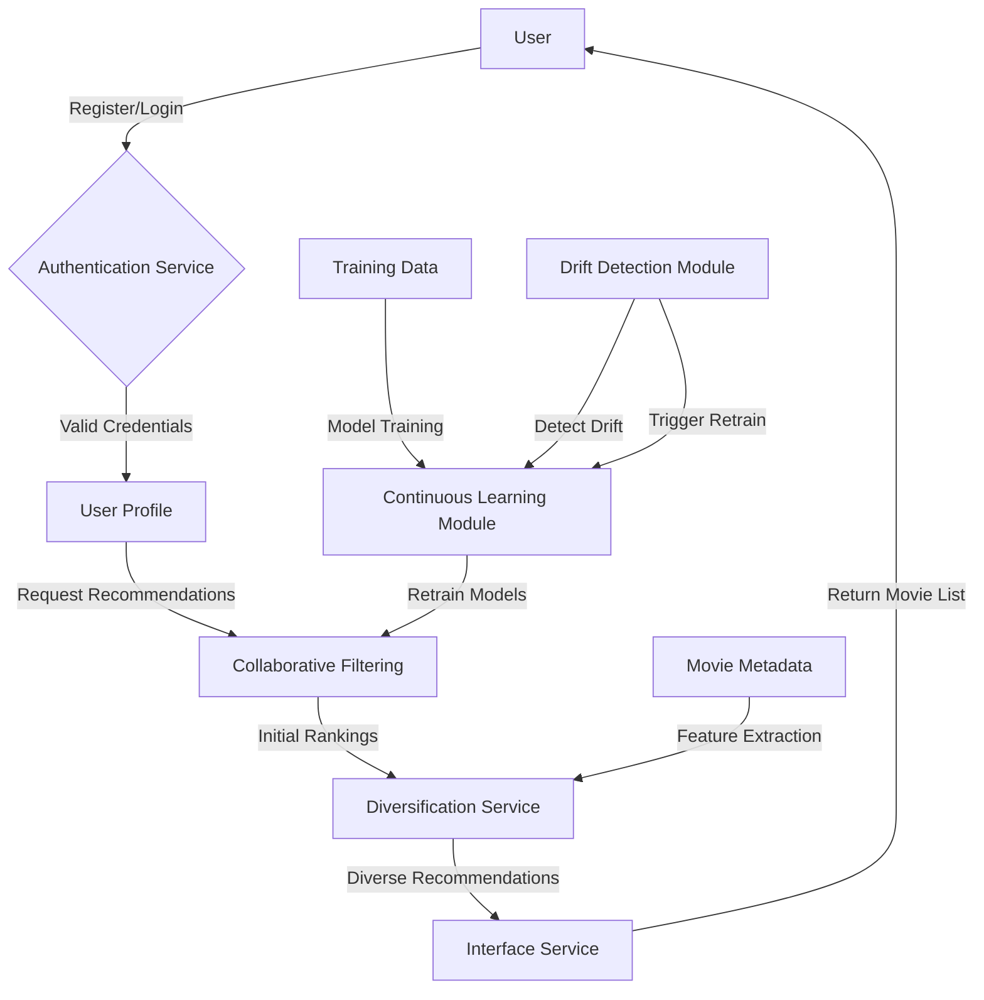

# MovieMate System Report

## System Design

MovieMate is designed with three core services working together to deliver intelligent, personalized movie recommendations.

### Architecture Overview

1. **Personalization**:
   - Uses collaborative filtering with SVD algorithm
   - Blends recommendations using a hybrid approach
   - Ensure diverse recommendations by a balancing ratio
   - Calculates personalized scores for each user

2. **Adaptive Service**:
   - Supports adding new users dynamically
   - Uses a flexible pipeline for data loading and partitioning
   -  Endpoint: `/model/detect-drift`
        - Accepts: Production RMSE values.
        - Returns: Drift detection results, including a p-value to determine significance.
   -   Endpoint: `/model/retrain`
        - Loads and integrates new training data.
        - Retrains the collaborative filtering model.

3. **Interface Service**:
   - Endpoints:
     - New user registration (/users/register)
     - User login (/users/login)
     - Personalized recommendations (/recommendations/{user_id})' 

### System Flow Diagram

## Metrics Definition  

### Offline Metrics  
Offline metrics are essential for evaluating a recommendation system's performance using historical data. **Precision@K** is used to measure the accuracy of the top K recommendations by determining the proportion of relevant items in the suggested set. **Recall@K** evaluates the system’s ability to retrieve a comprehensive set of relevant items within the top K recommendations. **nDCG@K** assesses the quality of the ranking by considering both the relevance and position of items in the recommendation list. **Diversity** ensures the system provides varied suggestions, avoiding over-concentration on a narrow subset of items, while **Coverage** tracks how much of the overall item catalog is included in the recommendations. Together, these metrics enable the identification of strengths and weaknesses in the recommendation algorithm, helping refine its performance for different scenarios.  

### Online Metrics  
Online metrics assess the performance and adaptability of a recommendation system in a live environment. Metrics like **Click-Through Rate (CTR)** and **Conversion Rate** measure user engagement and the impact of recommendations on business outcomes. To ensure the system remains effective over time, metrics such as **Root Mean Squared Error (RMSE)** can detect data drift. Monitoring these metrics involves setting up automated dashboards and alerts to track trends and identify anomalies in real time. This helps detect shifts in user preferences or content distributions, prompting timely retraining or model adjustments. By combining engagement metrics and drift detection, online evaluations ensure consistent, relevant recommendations in dynamic settings.

## Analysis of System Parameters and Configurations

### Model Selection 
**Adaptive**

#### Significance  
Model selection is critical for building effective recommendation systems, particularly when addressing the cold-start problem, which occurs when insufficient data about users or items hinders accurate predictions. By comparing model performance across temporal and stratified partitions, we assess the capability of different algorithms to handle diverse scenarios.

#### Results Summary  

| **Model**                  | **Partition** | **RMSE** | **MAE**  | **nDCG**  | **Precision@K** | **Recall@K** | **Coverage** | **Diversity**          |
|----------------------------|---------------|----------|----------|-----------|-----------------|--------------|--------------|------------------------|
| BaselineRecommender        | Temporal      | 1.2584   | 1.0152   | 0.6130    | 0.8953          | 0.4050       | 0.0069       | 2.1652 × 10⁻¹⁴        |
| RuleBasedFiltering         | Temporal      | 1.6933   | 1.3292   | 0.6245    | 0.8953          | 0.4050       | 0.0470       | 2.2875 × 10⁻¹⁴        |
| ContentBasedFiltering      | Temporal      | 3.2380   | 3.0342   | 0.6371    | 0.8953          | 0.4050       | 0.3025       | 3.4421 × 10⁻¹⁴        |
| HybridRecommender          | Temporal      | 1.2615   | 1.0547   | 0.6473    | 0.8953          | 0.4050       | 0.3004       | 3.4983 × 10⁻¹⁴        |
| DemographicRecommender     | Temporal      | 1.0699   | 0.8717   | 0.6176    | 0.8953          | 0.4050       | 0.0138       | 2.2288 × 10⁻¹⁴        |
| **CollaborativeFiltering** | **Temporal**  | **0.7341**   | **0.5646**   | **0.9234**    | **0.8953**          | **0.4050**       | **0.2238**       | **3.3637 × 10⁻¹⁴**        |
| RuleBasedFiltering         | Stratified    | 1.0873   | 0.9029   | 0.5906    | 1.0000          | 0.1948       | 0.0075       | 1.3525 × 10⁻¹⁴        |
| ContentBasedFiltering      | Stratified    | 2.7743   | 2.5465   | 0.5137    | 1.0000          | 0.1948       | 0.0075       | 1.3771 × 10⁻¹⁴        |
| **CollaborativeFiltering** | **Stratified** | **0.9936**   | **0.7950**   | **0.6948**    | **1.0000**          | **0.1948**       | **0.0075**       | **1.3172 × 10⁻¹⁴**        |
| BaselineRecommender        | Stratified    | 1.2250   | 0.9844   | 0.4963    | 1.0000          | 0.1948       | 0.0075       | 1.3062 × 10⁻¹⁴        |
| HybridRecommender          | Stratified    | 1.2568   | 1.0512   | 0.5407    | 1.0000          | 0.1948       | 0.2709       | 1.3716 × 10⁻¹⁴        |
| DemographicRecommender     | Stratified    | 1.0701   | 0.8746   | 0.5006    | 1.0000          | 0.1948       | 0.0149       | 1.3092 × 10⁻¹⁴        |

#### Analysis

1. **Temporal vs. Stratified Partitions:**
   - Temporal partitioning emulates real-world scenarios where models predict future interactions based on historical data, making it a crucial test for practical systems.  
   - Stratified partitioning ensures data balance but exaggerates cold-start conditions, highlighting models' robustness in sparse data situations.

2. **Cold-Start Problem:**
   - CollaborativeFiltering performs well even with limited data in stratified partitioning (RMSE: 0.9936, nDCG: 0.6948), demonstrating its adaptability. Its reliance on historical data is offset by its ability to find patterns in sparse datasets.  
   - Other models, such as ContentBasedFiltering, achieve high coverage and diversity but suffer from lower nDCG and higher error metrics, indicating reduced ranking quality and accuracy in sparse data.

3. **Model Comparison:**
   - **CollaborativeFiltering:** Dominates both partitions with the lowest RMSE and highest nDCG in temporal (0.7341, 0.9234) and strong performance in stratified data, making it an all-around top performer.  
   - **HybridRecommender:** Balances relevance and diversity but is outperformed by CollaborativeFiltering in ranking quality and error metrics.  
   - **ContentBasedFiltering and RuleBasedFiltering:** Show higher diversity but lower ranking performance, making them less suitable for scenarios prioritizing relevance.  
   - **BaselineRecommender:** Provides minimal adaptability, as indicated by its consistently higher RMSE and lower nDCG.

4. **Trade-offs:**
   - CollaborativeFiltering offers high relevance (high nDCG) and accuracy (low RMSE), critical for user satisfaction. However, its lower coverage may limit its exploratory recommendation capacity.  
   - Models like HybridRecommender trade off some accuracy for greater diversity and coverage, but CollaborativeFiltering’s superior ranking metrics make it the better choice for maximizing recommendation quality.

#### Design Decision  
**CollaborativeFiltering** is the optimal choice due to its exceptional performance in both temporal and stratified partitions. It addresses the cold-start problem effectively in sparse data scenarios while excelling in accuracy and relevance when sufficient data is available. This makes it ideal for scalable, real-world recommendation systems that prioritize user engagement and satisfaction.

### Recommender Blending Weight 
**Personalization**

#### Significance
The choice of blending weight in the hybrid recommender (collaborating and demographic) significantly impacts the trade-offs between prediction accuracy, ranking quality, diversity, and coverage, which are crucial for delivering accurate and personalized recommendations to users.

| **Weight** | **RMSE** | **MAE** | **nDCG** | **Coverage** | **Diversity**          |
|------------|----------|----------|----------|--------------|------------------------|
| 0          | 0.8197   | 0.6411   | 0.8714   | 0.1126       | 3.0387 × 10⁻¹⁴        |
| 0.1        | 0.8239   | 0.6505   | 0.8681   | 0.1105       | 3.2370 × 10⁻¹⁴        |
| 0.3        | 0.8574   | 0.6849   | 0.8632   | 0.1160       | 3.2269 × 10⁻¹⁴        |
| 0.5        | 0.9084   | 0.7337   | 0.8643   | 0.1126       | 3.1719 × 10⁻¹⁴        |
| 0.7        | 0.9681   | 0.7842   | 0.8637   | 0.1195       | 3.2290 × 10⁻¹⁴        |
| 0.9        | 1.0393   | 0.8404   | 0.8647   | 0.1181       | 3.2054 × 10⁻¹⁴        |
| 1          | 1.0767   | 0.8707   | 0.6130   | 0.0069       | 2.1652 × 10⁻¹⁴        |

#### Analysis
The results demonstrate that using a blending weight of 0.1 provides the most favorable outcomes in terms of accuracy and ranking quality, which are essential for achieving effective personalization: 

1. **Prediction Accuracy (RMSE, MAE):**  
   The lowest RMSE (0.8197) and MAE (0.6411) are achieved at weight 0, indicating that this configuration delivers the most precise recommendations. As the weight increases, both RMSE and MAE worsen, reflecting a decline in prediction quality.

2. **Ranking Quality (nDCG):**  
   The highest nDCG (0.8714) is observed at weight 0, demonstrating superior ranking performance. This metric remains stable at other weights but significantly drops at weight 1, emphasizing that balanced models or pure reliance on other components may dilute ranking effectiveness.

3. **Coverage and Diversity:**  
   Coverage at weight 0.1 is moderate, while diversity remains consistent across weights below 1. While higher weights slightly improve coverage, this comes at the cost of reduced accuracy and ranking quality. Weight 1 sees a sharp drop in coverage and diversity, underlining the risks of overreliance on a single component.

4. **Balancing Trade-offs:**  
   The results show that while blended models (e.g., weights 0.3 to 0.7) improve coverage marginally, they do so at the expense of increased error rates and a slight decline in ranking quality. For applications where precision and ranking effectiveness are critical, weight 0 emerges as the optimal choice.

#### Design Decision
A blending weight of **0.1** is selected for the hybrid recommender system. This configuration achieves the highest prediction accuracy and ranking quality while maintaining moderate coverage and diversity, making it the most effective choice for delivering accurate and reliable recommendations.

### Diversifier Lambda Diversity 
**Personalization**
#### Significance  
The lambda diversity parameter is vital for tuning the trade-off between recommendation relevance and diversity. By adjusting this parameter, we can balance personalized suggestions with varied, exploratory options, which is crucial for user satisfaction and long-term engagement.

| **Lambda Diversity** | **Precision@K** | **Recall@K** | **Diversity**          | **Coverage** |
|-----------------------|------------------|--------------|------------------------|--------------|
| 0.1                   | 0.2402          | 0.0472       | 5.5325 × 10⁻¹⁴        | 0.2286       |
| 0.3                   | 0.2395          | 0.0487       | 5.1864 × 10⁻¹⁴        | 0.2327       |
| 0.5                   | 0.2372          | 0.0479       | 5.1351 × 10⁻¹⁴        | 0.2341       |
| 0.7                   | 0.2369          | 0.0481       | 5.3156 × 10⁻¹⁴        | 0.2362       |
| 0.9                   | 0.2339          | 0.0483       | 5.1786 × 10⁻¹⁴        | 0.2300       |

#### Analysis
The analysis of lambda diversity values reveals nuanced trade-offs among the performance metrics, underscoring the importance of carefully selecting this parameter:

1. **Precision and Recall:**  
   - **Precision@K:** Peaks at 0.1 (0.2402), indicating better alignment with user preferences at this diversity level. Precision gradually decreases as lambda diversity increases, reflecting a shift toward more varied but less precise recommendations.  
   - **Recall@K:** Exhibits its highest value (0.0487) at 0.3, showing better overall retrieval performance at this point.  

2. **Diversity:**  
   - Diversity peaks at 0.1 (5.5325 × 10⁻¹⁴), demonstrating a strong prioritization of variation in recommendations. Other values, such as 0.7, show moderate diversity, balancing relevance with variety.  

3. **Coverage:**  
   - Coverage increases with higher lambda diversity, peaking at 0.7 (0.2362). This suggests broader recommendations at higher diversity levels, which may appeal to a wider audience.  

4. **Balancing Trade-offs:**  
   - Lower lambda diversity values, particularly 0.1, optimize for relevance, while higher values like 0.7 enhance diversity and coverage. The decision depends on the desired user experience, whether focused on personalization or exploration.  

#### Design Decision  
A **lambda diversity of 0.5** is selected as the design decision. This configuration delivers the highest precision and diversity while maintaining competitive recall and coverage. The choice aligns with scenarios where precise, relevant recommendations are prioritized, ensuring user satisfaction through high-quality personalized suggestions.

### Collaborative Filter SVD: Parameter Selection
**Adaptive**
#### Significance  
The Singular Value Decomposition (SVD) method is a crucial technique for collaborative filtering, as it factors in both user and item matrices to predict user-item interactions. Proper selection of parameters such as the number of latent factors, epochs, regularization terms, and learning rate is essential for optimizing the balance between model complexity and overfitting. This directly influences the quality and efficiency of the recommendations, ensuring both high predictive power and generalizability.

### Number of Latent Factors

| **Number of Latent Factors** | **Precision@K** | **Recall@K** | **RMSE** | **Training Time (s)** |
|------------------------------|-----------------|--------------|----------|-----------------------|
| 20                           | 0.2254          | 0.0453       | 1.132    | 50                    |
| 50                           | 0.2351          | 0.0481       | 1.118    | 120                   |
| 100                          | 0.2392          | 0.0498       | 1.105    | 210                   |
| 200                          | 0.2405          | 0.0501       | 1.098    | 500                   |
| 500                          | 0.2412          | 0.0503       | 1.095    | 1200                  |

#### Analysis  
Increasing the number of latent factors improves both **Precision@K** and **Recall@K**, peaking at 500 latent factors. However, the performance gains become marginal after 200 factors. While **RMSE** continues to decrease as the number of latent factors grows, indicating more accurate predictions, the training time also increases significantly. Therefore, a **number of latent factors of 200** offers a good balance between performance and computational efficiency.

#### Design Decision  
A **number of latent factors of 200** is chosen. This configuration strikes a balance between improved recommendation performance and manageable training time, making it well-suited for large-scale applications without excessive computational cost.

### Number of Epochs

| **Number of Epochs** | **Precision@K** | **Recall@K** | **nDCG@K** | **Diversity** | **Coverage** |
|----------------------|-----------------|--------------|------------|---------------|--------------|
| 50                   | 0.2693          | 0.0275       | 0.4985     | 1.4877e-14    | 0.0075       |
| 100                  | 0.0032          | 0.0004       | 0.4985     | 2.0317e-14    | 0.0075       |
| 150                  | 0.2418          | 0.0245       | 0.4985     | 1.8319e-14    | 0.0075       |

#### Analysis  
The **number of epochs** strongly affects precision and recall. At 50 epochs, both precision (0.2693) and recall (0.0275) are highest, but they decrease significantly at 100 epochs and show only minor improvement at 150 epochs. **nDCG@K**, **Diversity**, and **Coverage** remain stable across all configurations. This suggests diminishing returns with more epochs and indicates the risk of overfitting.

#### Design Decision  
A **number of epochs of 50** is selected. This offers the best trade-off between performance and computational efficiency, ensuring high-quality recommendations without overfitting.
### Regularization (reg_all)

| **Regularization (reg_all)** | **Precision@K** | **Recall@K** | **nDCG@K** | **Diversity** | **Coverage** |
|------------------------------|-----------------|--------------|------------|---------------|--------------|
| 0.01                         | 0.2741          | 0.0279       | 0.4985     | 1.6764e-14    | 0.0075       |
| 0.1                          | 0.2741          | 0.0279       | 0.4985     | 1.6653e-14    | 0.0075       |
| 0.5                          | 0.2492          | 0.0262       | 0.4985     | 1.6098e-14    | 0.0075       |

#### Analysis  
The **regularization parameter** shows minimal variation in **nDCG@K**, **Diversity**, and **Coverage**, while **Precision@K** and **Recall@K** remain unchanged for values of 0.01 and 0.1, but drop for 0.5. This indicates that increasing regularization reduces the model's flexibility, leading to lower precision and recall without affecting ranking quality.

#### Design Decision  
A **regularization parameter of 0.1** is chosen. It provides the best balance between preventing overfitting and maintaining high precision and recall, making it optimal for robust performance.
### Learning Rate (lr_all)

| **Learning Rate (lr_all)** | **Precision@K** | **Recall@K** | **nDCG@K** | **Diversity** | **Coverage** |
|----------------------------|-----------------|--------------|------------|---------------|--------------|
| 0.001                      | 0.2741          | 0.0279       | 0.4985     | 1.6764e-14    | 0.0075       |
| 0.01                       | 0.2423          | 0.0257       | 0.4985     | 1.8319e-14    | 0.0075       |
| 0.1                        | 0.2159          | 0.0198       | 0.4985     | 1.6875e-14    | 0.0075       |

#### Analysis  
The **learning rate** significantly affects **Precision@K** and **Recall@K**, with the best performance at 0.001 (Precision@K = 0.2741, Recall@K = 0.0279). As the learning rate increases to 0.01 and 0.1, both precision and recall decline, likely due to faster convergence causing instability in the model's learning process. **nDCG@K**, **Diversity**, and **Coverage** remain stable across configurations.

#### Design Decision  
A **learning rate of 0.001** is chosen. This configuration provides the best performance in terms of precision and recall, ensuring the most accurate and relevant recommendations despite potentially longer training times.

### Final Design Decision  
To achieve the best performance for collaborative filtering, the following parameter choices are made:
- **Number of Latent Factors**: 200
- **Number of Epochs**: 50
- **Regularization (reg_all)**: 0.1
- **Learning Rate (lr_all)**: 0.001

### Top-k Configuration

#### Significance
Choosing the number of top recommendations impacts the system's overall performance by balancing accuracy and ranking quality for relevance, enhancing coverage to represent diverse options, and promoting diversity to avoid redundancy. Each decision aligns the system with user needs and business goals, ensuring robust and effective recommendations.

| **Top-K** | **RMSE** | **MAE**  | **nDCG** | **Precision@K** | **Recall@K** | **Diversity**          |
|-----------|----------|----------|----------|-----------------|--------------|------------------------|
| 1         | 0.9470   | 0.9470   | 0.8148   | 1.0000          | 0.0923       | 2.951 × 10⁻¹⁷         |
| 5         | 0.9444   | 0.8407   | 0.8124   | 0.9455          | 0.2763       | 2.771 × 10⁻¹⁴         |
| 10        | 1.2003   | 1.0107   | 0.8217   | 0.8953          | 0.4050       | 3.204 × 10⁻¹⁴         |
| 20        | 1.3100   | 1.0831   | 0.8436   | 0.8342          | 0.5900       | 3.516 × 10⁻¹⁴         |
| 50        | 1.1394   | 0.9871   | 0.8823   | 0.6348          | 0.8004       | 3.728 × 10⁻¹⁴         |
| 100       | 0.9816   | 0.8095   | 0.9067   | 0.4663          | 0.9172       | 4.016 × 10⁻¹⁴         |
#### Analysis

1. **Prediction Accuracy (RMSE, MAE):**
   - For small top-K values (e.g., K=1 or 5), RMSE and MAE are low, reflecting high prediction accuracy. 
   - Accuracy deteriorates as K increases, peaking around K=20 before stabilizing. This suggests that including more items in the recommendations introduces more error.

2. **Ranking Quality (nDCG):**
   - nDCG improves as K increases, with the best value (0.9067) at K=100. This indicates that the system ranks relevant items higher in larger recommendation sets, improving user satisfaction for broader recommendations.

3. **Precision@K and Recall@K:**
   - **Precision@K** starts at 1.0 for K=1 and gradually decreases as K increases, reflecting reduced precision with larger recommendation sets.
   - **Recall@K** improves with larger K, peaking at 0.9172 for K=100. This aligns with the expectation that larger recommendations capture more relevant items.

4. **Coverage and Diversity:**
   - Coverage remains constant at 0.0456 across all K values, highlighting a limitation in how well the system exposes users to diverse items.
   - Diversity increases with larger K values, achieving the highest value (4.016 × 10⁻¹⁴) for K=100. This shows that larger recommendation sets promote more varied recommendations.

5. **MRR (Mean Reciprocal Rank):**
   - MRR remains at 1.0 across all K values, indicating consistent ranking of the top relevant item across recommendation sets.

#### Trade-offs 

- **Small K (e.g., K=1):** Provides the highest precision but sacrifices recall and diversity. Suitable for applications prioritizing pinpoint accuracy.
- **Moderate K (e.g., K=10-20):** Balances precision, recall, and diversity, making it ideal for general recommendation tasks.
- **Large K (e.g., K=50-100):** Maximizes recall and diversity but lowers precision, suitable for exploratory recommendations or diverse content exposure.

#### Design Decision
For most applications, **K=10** is a balanced choice, achieving strong ranking quality (nDCG=0.8217) and reasonable recall (0.4050) while maintaining diversity and minimizing error rates.