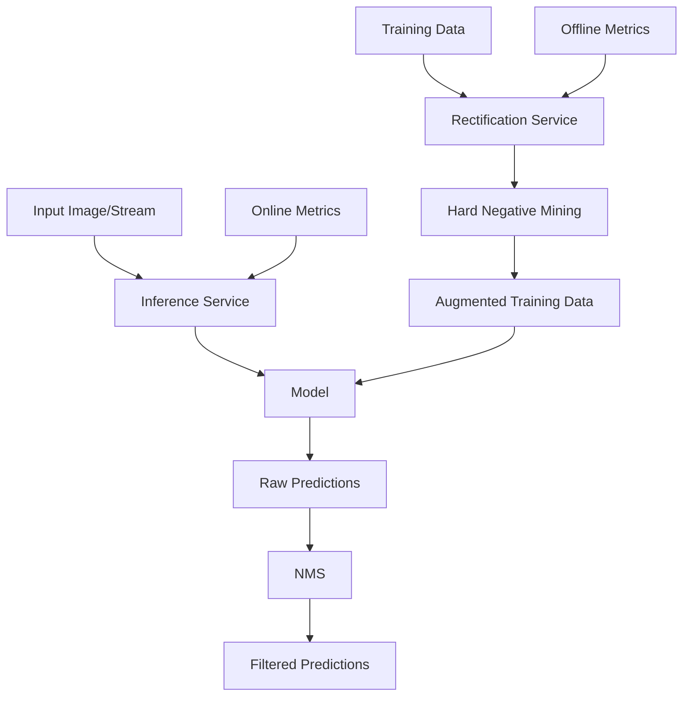

# TechTrack Object Detection System Report

## System Design

1. **Model**
    - This service is responsible for processing input images and generating raw predictions. It uses a YOLO architecture implemented with OpenCV's module. The model loads pre-trained weights and configuration files, processes input frames, and outputs bounding boxes, class IDs, and confidence scores for detected objects.

2. **NMS (Non-Maximum Suppression)**
    - This component filters the raw predictions from the Model to remove redundant detections. It applies score thresholding and IoU (Intersection over Union) based filtering to retain only the most confident and non-overlapping predictions.

3. **Hard Negative Mining**
    - This service enhances the training dataset by identifying challenging negative examples that closely resemble the positive class. This involves training a model on a balanced dataset, predicting on new data to find misclassified or borderline negatives, and incorporating these hard negatives back into the training set. This process improves the model’s accuracy and reduces false positives.

3. **Augmentation** 
    - This service enhances the training data by applying various transformations to the input images. It includes operations like horizontal flipping, Gaussian blurring, resizing, rotation, brightness adjustment, and noise addition. This component helps improve the model's robustness and generalization capabilities.

4. **Inference Service**
    - This component handles real-time object detection requests. It takes input images, processes them through the Model and NMS components, and returns the filtered predictions.

5. **Rectification Service** 
    - This service is responsible for improving the model's performance over time. It analyzes the model's predictions, compares them with ground truth data, and generates insights for model updates or retraining.

## Metrics Definition

### Offline Metrics

Offline metrics are crucial for evaluating the performance of a model after it has been trained and tested on a dataset. Key metrics include **Mean Average Precision (mAP)**, which measures the model's accuracy in detecting objects across various classes and Intersection over Union (IoU) thresholds. Additionally, **Precision and Recall** are used to assess the model's ability to correctly identify objects and its effectiveness in finding all relevant instances, respectively. The **F1 Score**, representing the harmonic mean of precision and recall, offers a balanced perspective on the model's performance. Other important metrics are the **False Positive Rate** and **False Negative Rate**, which indicate the frequency of incorrect positive predictions and missed actual objects, respectively. Together, these metrics provide a comprehensive understanding of the model's strengths and weaknesses, guiding future improvements.

### Online Metrics

Online metrics emphasize the real-time assessment of a model's performance during inference, offering immediate insights into its operational efficiency. **Inference Latency** refers to the time required to process an input image and generate predictions. Tracking the **F1 score**, which quantifies the model's accuracy by balancing precision and recall, is also essential for understanding its effectiveness in real-world applications. Additionally, tracking **CPU/GPU Utilization** helps assess the computational resources being utilized, and monitoring **Memory Usage** provides insights into the amount of memory consumed by the model and associated processes. These metrics can be monitored using logging frameworks and monitoring tools that provide real-time dashboards and alerts, enabling teams to quickly identify and address performance issues.

## Analysis of System Parameters and Configurations

1. **Model Input Size**:

The model uses a fixed input size of 416x416 pixels for processing images. This decision significantly impacts both inference speed and F1 score.

| Input Size     | Inference Latency | F1 Score |
|:------------- |:--------------:|---------------:|
| 224*224        | 0.0092        | 0.5007         |
| 320*320        | 0.0144        | 0.5629         |
| 416*416        | 0.0228        | 0.5812         |
| 512*512        | 0.0341        | 0.5660         |
| 608*608        | 0.0403        | 0.5092          |

This table highlights the relationship between input size, inference speed, and F1 score. As the input size increases, the F1 score tends to improve, indicating better model performance. However, larger input sizes also lead to slower inference speeds. The 416x416 size is a compromise that offers a relatively high F1 score while still maintaining a reasonable inference speed.

#### Role of Metrics:

**Inference Latency**: This measures the time it takes for the model to process a single frame (or image). In applications requiring real-time or near-real-time predictions, such as video analysis or autonomous driving, low latency is crucial. Faster processing, indicated by lower latency, allows the model to make decisions quickly, though it may sometimes come at the cost of reduced accuracy.

**F1 Score**: A metric that balances precision and recall, the F1 score provides a comprehensive view of model accuracy. In this context, it helps assess how well the model handles different input sizes and how this affects its ability to make correct predictions. High F1 scores indicate better performance, but increasing the input size beyond a certain point may lead to diminishing returns, as shown with the drop in F1 score at 608x608.

The choice of 416x416 provides an effective balance between speed and accuracy for this model, ensuring good predictive performance without excessive delays.

2. **NMS IoU Threshold**:
The Non-Maximum Suppression (NMS) IoU threshold determines how aggressively overlapping bounding boxes are filtered out during object detection. This parameter directly impacts the model's detection accuracy and the number of false positives produced.

| IoU Threshold | Mean Average Precision (mAP) | False Positives |
|:------------- |:--------------:|---------------:|
| 0.3        | 0.8836         | 9096         |
| 0.4        | 0.8576         | 5604         |
| 0.5        | 0.8130         | 3952         |
| 0.6        | 0.7402         | 3011         |
| 0.7        | 0.5958         | 2423         |

The table illustrates that increasing the IoU threshold reduces false positives but at the cost of a lower mean average precision (mAP). A threshold of 0.5 is selected to balance these effects, providing reasonably high detection precision while controlling the number of false positives.

#### Role of Metrics:

**Mean Average Precision (mAP)**: This measures the accuracy of the model by calculating the average precision across different detection classes and IoU thresholds. A high mAP indicates that the model is accurately detecting objects with minimal errors. As the IoU threshold increases, mAP decreases, indicating that fewer bounding boxes are retained, reducing the chance of detecting the correct object.

**False Positives**: This metric counts the number of incorrect detections (objects detected that don’t exist). Lower IoU thresholds are more lenient, keeping more bounding boxes and thus increasing the likelihood of false positives. Higher thresholds are stricter, removing more overlapping detections and reducing false positives. However, overly strict thresholds may also remove true positive detections, negatively impacting mAP.

In this analysis, the chosen IoU threshold of 0.5 strikes the best detection accuracy (mAP) and lowest false positives, making it an optimal choice for the task.

3. **Augmentation Techniques**:
The system implements six different augmentation techniques. This decision significantly impacts the model's ability to generalize and perform well on diverse input data.

| Augmentation   | Precision | Recall | 
|:------------- |:--------------:|---------------:|
| No Augmentation   | 0.8279         | 0.4678        |
| Horizontal Flip   | 0.8210         | 0.4621        |
| Gaussian Blur     | 0.8550         | 0.4567        |
| Resize            | 0.8589         | 0.4398        |
| Rotate            | 0.7580         | 0.1744        |
| Brightness        | 0.8366         | 0.4411        |
| Add Noise         | 0.8267         | 0.4685        |

The table illustrates the impact of different augmentation techniques on the model's precision and recall.

1. No Augmentation: This serves as the baseline, with a precision of 0.8279 and a recall of 0.4678. The model achieves a reasonably high precision, indicating that when it makes positive predictions, they are often correct. However, the recall is relatively low, suggesting that the model is missing a significant number of actual positive instances.

2. Horizontal Flip: The precision decreases slightly to 0.8210, with a corresponding decrease in recall to 0.4621. This indicates that flipping images horizontally may not provide significant benefits in this case.

3. Gaussian Blur: This technique improves precision to 0.8550 but results in a slight drop in recall to 0.4567. The increased precision suggests that the model is better at correctly identifying positive instances, albeit at the cost of recalling fewer true positives.

4. Resize: This augmentation technique yields the highest precision of 0.8589 but also comes with the lowest recall of 0.4398. The model performs well in terms of precision, indicating that the resized images help it make correct predictions, though it struggles to identify all relevant instances.

5. Rotate: The rotation augmentation shows a marked decrease in both precision (0.7580) and recall (0.1744). This suggests that this technique may introduce too much variability in the images, making it difficult for the model to learn meaningful patterns.

6. Brightness: The precision of 0.8366 indicates that this augmentation maintains a good level of accuracy, but the recall remains low at 0.4411, similar to other augmentations. This implies that while the model can make correct predictions, it still misses many positive cases.

7. Add Noise: This method results in a precision of 0.8267 and a recall of 0.4685. The noise augmentation seems to maintain a balance between precision and recall, comparable to the no-augmentation scenario.

#### Role of Metrics:

**Precision**: This metric measures the proportion of true positive predictions to the total positive predictions made by the model. High precision indicates that when the model predicts a positive instance, it is likely to be correct. In this context, augmentations that improve precision (like Gaussian Blur and Resize) help the model become more reliable in its predictions, which is crucial in applications where false positives are costly.

**Recall**: This metric assesses the proportion of true positive predictions to the total actual positives in the dataset. High recall signifies that the model can identify a large number of actual positive instances. The relatively low recall across most augmentations indicates that the model might be missing many true positive cases, which could limit its effectiveness in practical scenarios where capturing all relevant instances is essential.

The analysis of the various augmentation techniques reveals that while some methods, like Gaussian Blur and Resize, enhance precision, they may not sufficiently improve recall. The trade-offs highlighted in this analysis underscore the importance of selecting appropriate augmentation techniques to enhance model generalization while maintaining a balance between precision and recall.

4. **Drop Rate for Stream Processing**: The system implements a drop rate mechanism for handling high-throughput video streams. This decision significantly impacts the balance between processing all frames and maintaining real-time performance.

| Drop Rate  | Inference Latency | F1 Score | False Negatives |
|:------------- |:--------------:|---------------:|---------------:|
| 0          |  0.0228        |  0.5812        | 19146          |
| 0.2        |  0.0209        |  0.5783        | 19535          | 
| 0.4        |  0.0185        | 0.5465         | 19713          |
| 0.6        |  0.0167        | 0.5250         | 22190          |
| 0.8        |  0.0154        | 0.5022         | 22406          |

The table illustrates the trade-offs in adjusting the drop rate for stream processing. Increasing the drop rate enhances processing speed and reduces latency, allowing for better real-time performance. However, this may compromise performance by missing critical frames essential for object detection. Lower drop rates utilize computational resources fully but can cause backlogs during high-throughput periods. 

#### Role of Metrics:

**Inference Latency**: This metric measures the time taken to process each frame. A lower inference latency is critical in high-throughput environments, such as real-time video analysis, where timely responses are essential. However, as seen in the data, reducing latency at the expense of detection accuracy can be detrimental to overall system performance.

**F1 Score: The F1 score balances precision and recall, providing a comprehensive view of the model's predictive performance. A declining F1 score as the drop rate increases indicates that while the system may process frames faster, it is becoming less reliable in accurately identifying true positives, which can be particularly problematic in applications where detection accuracy is paramount.

**False Negatives**: This metric counts the instances where the model fails to identify true positives. An increase in false negatives with higher drop rates reveals that dropping too many frames can lead to critical missed detections, which undermines the effectiveness of the system, especially in scenarios where identifying all relevant instances is crucial.

5. **Score Threshold in NMS**:
The score threshold (set to 0.5) in the NMS class determines which detections are considered valid based on their confidence scores. This parameter significantly impacts the balance between precision and recall in the system's output.

| Score Threshold | Precision | Recall |
|:------------- |:--------------:|---------------:|
| 0.3        | 0.8093         | 0.4569         |
| 0.4        | 0.8093         | 0.4569         |
| 0.5        | 0.8093         | 0.4569         |
| 0.6        | 0.8480         | 0.4051         |
| 0.7        | 0.8858         | 0.3479         |
| 0.8        | 0.9192         | 0.2837         |
| 0.9        | 0.9553         | 0.2002         |

The table illustrates that as the score threshold increases, precision improves but recall decreases. The chosen threshold of 0.5 provides a balance between precision and recall, ensuring that the system retains most true positives while filtering out many false positives.

#### Role of Metrics:

**Precision**: Precision measures the accuracy of positive predictions, indicating the proportion of true positives among all predicted positives. Higher precision means fewer false positives, which is critical in scenarios where false alarms can have significant consequences.

**Recall**: Recall quantifies the model's ability to identify all relevant instances, representing the proportion of true positives among actual positives. A high recall is essential in applications where missing a true positive could be detrimental, such as in medical diagnoses or security applications.

6. **Hard Negatives Percentage**:
This analysis evaluates model performance on different percentages of selected hard negative samples, starting from the hardest cases (10%) and progressively including easier samples up to 80%. The analysis reveals how the proportion of difficult cases impacts model evaluation metrics.

| Hard Neg % | Precision | Recall | F1 Score |
|:-----------|:---------:|:------:|:--------:|
| 0.1        | 0.7288    | 0.3312 | 0.4554   |
| 0.2        | 0.7615    | 0.3588 | 0.4878   |
| 0.3        | 0.7650    | 0.3569 | 0.4868   |
| 0.4        | 0.7755    | 0.3765 | 0.5069   |
| 0.5        | 0.7689    | 0.3695 | 0.4991   |
| 0.6        | 0.7784    | 0.3915 | 0.5210   |
| 0.7        | 0.7867    | 0.4106 | 0.5396   |
| 0.8        | 0.7955    | 0.4271 | 0.5558   |

#### Role of Metrics

**Precision**: In the context of hard negatives, precision measures the model's ability to maintain accurate predictions as easier samples are included. The modest increase from 0.7288 to 0.7955 suggests that the model's discrimination ability remains relatively stable across difficulty levels.

**Recall**: This metric is particularly revealing for hard negative evaluation, as it shows how the model's ability to detect positive cases improves with easier samples. The improvement from 0.3312 to 0.4271 indicates that truly hard negatives pose significant challenges for detection.

**F1 Score**: As a balanced measure, the F1 score's progression from 0.4554 to 0.5558 quantifies the overall impact of including easier samples, showing a substantial improvement in model performance.

#### Impact Analysis

The evaluation of model performance across different percentages of hard negatives reveals several key patterns:

1. **Performance on Hardest Cases (10%)**:
- Lowest overall metrics (Precision: 0.7288, Recall: 0.3312, F1: 0.4554)
- Shows model's baseline capability on most challenging samples
- Particularly low recall indicates difficulty with complex positive cases

2. **Metric Progression (10% → 80%)**:
- Precision: 0.7288 → 0.7955 (+0.0667)
- Recall: 0.3312 → 0.4271 (+0.0959)
- F1 Score: 0.4554 → 0.5558 (+0.1004)

The larger improvement in recall compared to precision indicates that while the model maintains relatively consistent prediction accuracy, it becomes significantly better at detecting positive cases as easier samples are included.

The clear performance gap between lower and higher percentages confirms that the hard negative selection effectively identifies genuinely challenging cases. The steady improvement in metrics as easier samples are included validates both the selection method and provides a clear view of model performance across different difficulty levels.

#### For the Inference Service:
   - Implement adaptive input sizing based on the client's requirements and available computational resources.
    - Adjust the drop rate dynamically to balance processing speed and accuracy based on real-time demands.

#### For the Rectification Service:
   - Implement a mechanism to dynamically adjust the proportion of hard negative samples and assess model performance..
   - Continuously evaluate the effectiveness of different augmentation techniques and adjust the augmentation pipeline accordingly.

These design considerations will help create a more flexible and adaptable object detection system that can be fine-tuned for various applications and deployment environments.
