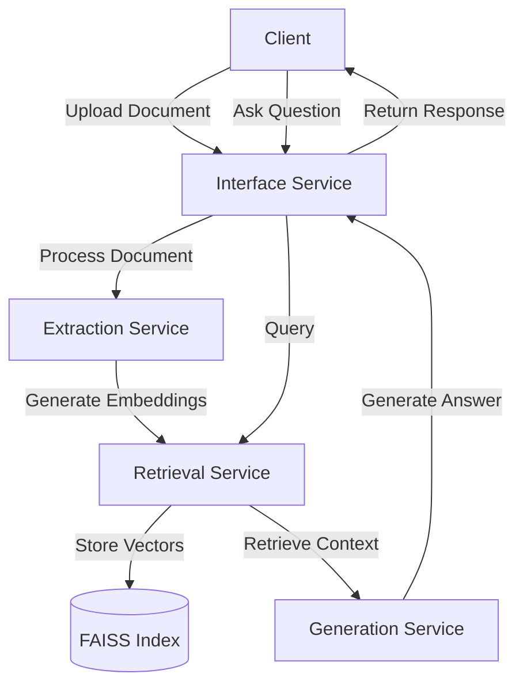

# Textwave System Report

## System Design

The system comprises four core services working in concert to deliver accurate document retrieval and question answering capabilities:

### 1. Extraction Service
- Handles document preprocessing and embedding generation
- Components:
  - DocumentProcessing: Chunks documents using sentence or fixed-length strategies
  - Embedding: Generates embeddings using SentenceTransformer models
- Features:
  - Flexible chunking strategies
  - Configurable overlap between chunks
  - Support for various embedding models

### 2. Retrieval Service
- Manages document indexing and similarity search
- Components:
  - FaissIndex: Scalable vector indexing using FAISS
  - FaissSearch: Nearest neighbor search implementation
- Features:
  - Support for billion-scale document collections
  - Multiple distance metrics (euclidean, cosine, etc.)
  - Support k-nearest neighbor search

### 3. Generation Service
- Handles answer generation from retrieved context
- Components:
  - QA_Generator: Integrates with Mistral API for answer generation
- Features:
  - Context-aware answer generation
  - Configurable temperature for response diversity
  - Rate limiting and error handling

### 4. Interface Service
- Provides REST API endpoints for system interaction
- Endpoints:
  - /process_corpus: Index new documents
  - /upload_document: Add individual documents
  - /ask: Generate answers to questions

## System Flow Architecture

## Metrics Definition

### Offline Metrics
The system uses comprehensive offline metrics to assess result quality on historical data. These include ranking metrics such as Mean Reciprocal Rank (MRR), Precision@k, Average Precision@k (AP@k), Recall@k, and Normalized Discounted Cumulative Gain@k (NDCG@k) to evaluate retrieval effectiveness, alongside quality metrics like semantic similarity and answer coverage to measure answer reliability. These metrics provide insights into system performance, enabling iterative improvements during development.

### Online Metrics
Online metrics monitor real-time system performance through system performance metrics (latency percentiles, error rates). These metrics are monitored with configured alerting thresholds, enabling quick detection of performance degradation and system health issues.

## Analysis of Design Parameters and Configurations

### 1. Chunking Strategy (Extraction Service)
**Significance**: Chunking strategy directly impacts context preservation and retrieval accuracy.

| **Strategy**           | **Overlap Size** | **Chunk Size** | **MRR**  | **Recall@K** | **Precision@K** | **Semantic Similarity** | **Mean Latency (s)** |
|------------------------|------------------|----------------|----------|---------------|------------------|-------------------------|-----------------------|
| Sentence              | 2                | N/A            | 0.4283   | 0.5596        | 0.1798           | 0.5596                  | 0.0260                |
| Sentence              | 5                | N/A            | 0.4306   | 0.5321        | 0.2000           | 0.5582                  | 0.0245                |
| Sentence              | 10               | N/A            | 0.2691   | 0.3211        | 0.1358           | 0.4168                  | 0.0254                |
| Fixed-Length          | 5                | 50             | 0.4766   | 0.5596        | 0.1890           | 0.5563                  | 0.0250                |
| Fixed-Length          | 5                | 100            | 0.3291   | 0.4679        | 0.1853           | 0.4878                  | 0.0249                |
| Fixed-Length          | 5                | 200            | 0.3196   | 0.3853        | 0.1486           | 0.4455                  | 0.0258                |
| Fixed-Length          | 10               | 50             | 0.4512   | 0.5596        | 0.2092           | 0.5474                  | 0.0249                |
| Fixed-Length          | 10               | 100            | 0.4067   | 0.5046        | 0.2037           | 0.5273                  | 0.0249                |
| Fixed-Length          | 10               | 200            | 0.3089   | 0.3853        | 0.1376           | 0.4371                  | 0.0260                |

**Analysis**: Comparing sentence-based vs. fixed-length strategies with varying overlap sizes:
- Fixed-length (50 tokens) with 10-token overlap shows optimal performance:
  - Highest MRR (0.4512)
  - Strong Recall@K (0.5596)
  - Best Precision@K (0.2092)
- Sentence-based strategies perform well with small overlaps but degrade with larger ones
- Latency remains consistent across strategies (~0.025s mean)

**Design Decision**: Implement fixed-length chunking with 50-token chunks and 10-token overlap for optimal balance.

### 2. Embedding Model Selection (Extraction Service)
**Significance**: Embedding model choice affects semantic understanding and retrieval accuracy.

| Metric            | **all-mpnet-base-v2** | **multi-qa-mpnet-base-dot-v1** | **all-MiniLM-L12-v2** | **all-MiniLM-L6-v2** | **paraphrase-multilingual-mpnet-base-v2** |
|-------------------|-----------------------|-------------------------------|-----------------------|----------------------|------------------------------------------|
| **MRR**          | 0.439                | 0.353                        | 0.433                | 0.428               | 0.474                                    |
| **Recall@K**     | 0.560                | 0.468                        | 0.578                | 0.560               | 0.569                                    |
| **AP@K**         | 0.431                | 0.346                        | 0.433                | 0.415               | 0.465                                    |
| **NDCG@K**       | 0.746                | 0.731                        | 0.725                | 0.726               | 0.749                                    |
| **Mean Latency**  | 0.055                | 0.032                        | 0.053                | 0.021               | 0.076                                    |
| **P99 Latency**   | 0.260                | 0.061                        | 0.258                | 0.040               | 0.514                                    |

**Analysis**: Comparing different SentenceTransformer models:
- paraphrase-multilingual-mpnet-base-v2 shows best overall performance:
  - Highest MRR (0.474)
  - Best NDCG@K (0.749)
  - Strong semantic similarity (0.570)
- all-MiniLM-L6-v2 offers fastest processing:
  - Lowest mean latency (0.021s)
  - Competitive accuracy metrics

**Design Decision**: Use all-MiniLM-L6-v2 for latency-sensitive cases.

### 3. Reranking Strategy (Retrieval Service)
**Significance**: Reranking affects final result quality and system latency.

| **Metric**                    | **None**    | **Cross-Encoder** | **TF-IDF**   | **Hybrid**   | **Sequential** | **TF-IDF Corpus** |
|-------------------------------|-------------|------------------|--------------|--------------|----------------|-------------------|
| **MRR**                        | 0.428       | 0.502            | 0.499        | 0.496        | 0.407          | 0.484             |
| **Recall@k**                   | 0.560       | 0.560            | 0.560        | 0.560        | 0.560          | 0.560             |
| **AP@k**                       | 0.415       | 0.488            | 0.487        | 0.484        | 0.397          | 0.475             |
| **NDCG@k**                     | 0.726       | 0.782            | 0.779        | 0.777        | 0.717          | 0.774             |
| **Mean Latency (s)**           | 0.0316      | 0.0797           | 0.064        | 0.079        | 0.077          | 0.049             |
| **P99 Latency (s)**            | 0.154       | 0.102            | 0.182        | 0.099        | 0.101          | 0.061             |

**Analysis**: Comparing different reranking approaches:
- Cross-Encoder shows best ranking performance:
  - Highest MRR (0.502)
  - Best NDCG@k (0.782)
- However, introduces higher latency (0.0797s mean)
- TF-IDF_corpus offers good balance:
  - Competitive MRR (0.484)
  - Lower latency (0.049s mean)

**Design Decision**: Implement TF-IDF_corpus for balanced performance between ranking performance and latency.

### 4. Generation Temperature (Generation Service)
**Significance**: Temperature affects answer diversity and generation speed.

| Metric                          | t=0.0  | t=0.3  | t=0.6  | t=0.9  |
|----------------------------------|--------|--------|--------|--------|
| **MRR**  | 0.428  | 0.428  | 0.428  | 0.428  |
| **Recall@k**                     | 0.560  | 0.560  | 0.560  | 0.560  |
| **Precision@k**                  | 0.180  | 0.180  | 0.180  | 0.180  |
| **Answer Coverage**              | 0.835  | 0.835  | 0.835  | 0.835  |
| **Mean Latency (s)**             | 0.032  | 0.019  | 0.018  | 0.018  |
| **P99 Latency (s)**              | 0.159  | 0.032  | 0.033  | 0.031  |
| **Error Rate**                   | 0.165  | 0.165  | 0.165  | 0.165  |

**Analysis**: Testing different temperature values (t):
- Core metrics remain stable across t values
- Latency improves with higher t:
  - t=0.0: 0.032s mean latency
  - t≥0.6: 0.018s mean latency
- Error rates consistent across all values

**Design Decision**: Use t=0.3 for optimal balance between diversity and speed.

### 5. Top-k Configuration (Retrieval Service)
**Significance**: Top-k affects result quality and system resource usage.

| Metric | k=1 | k=3 | k=5 | k=7 | k=10 |
|--------|-----|-----|-----|-----|------|
| **MRR ** | 0.3486 | 0.4771 | 0.5023 | 0.5130 | 0.5130 |
| **Recall@k** | 0.3486 | 0.5046 | 0.5596 | 0.5872 | 0.5872 |
| **Precision@k** | 0.3486 | 0.2263 | 0.1798 | 0.1691 | 0.1413 |
| **AP@k** | 0.3486 | 0.4717 | 0.4880 | 0.4936 | 0.4846 |
| **NDCG@k** | 0.8349 | 0.8037 | 0.7819 | 0.7684 | 0.7620 |
| **Semantic Similarity** | 0.3824 | 0.5250 | 0.5596 | 0.5845 | 0.5889 |
| **Mean Latency** | 0.0315 | 0.0655 | 0.0734 | 0.0806 | 0.1409 |
| **P90 Latency** | 0.1013 | 0.0739 | 0.0838 | 0.0914 | 0.1581 |
| **P99 Latency** | 0.1558 | 0.0806 | 0.0922 | 0.1087 | 0.1750 |

**Analysis**: Testing different k values (1-10):
- MRR and Recall improve until k=7:
  - k=7: MRR=0.513, Recall=0.587
  - Minimal gains beyond k=7
- Precision decreases with higher k
- Latency increases significantly:
  - k=1: 0.0315s mean
  - k=10: 0.1409s mean

**Design Decision**: Set k=5 for optimal balance between recall and latency.